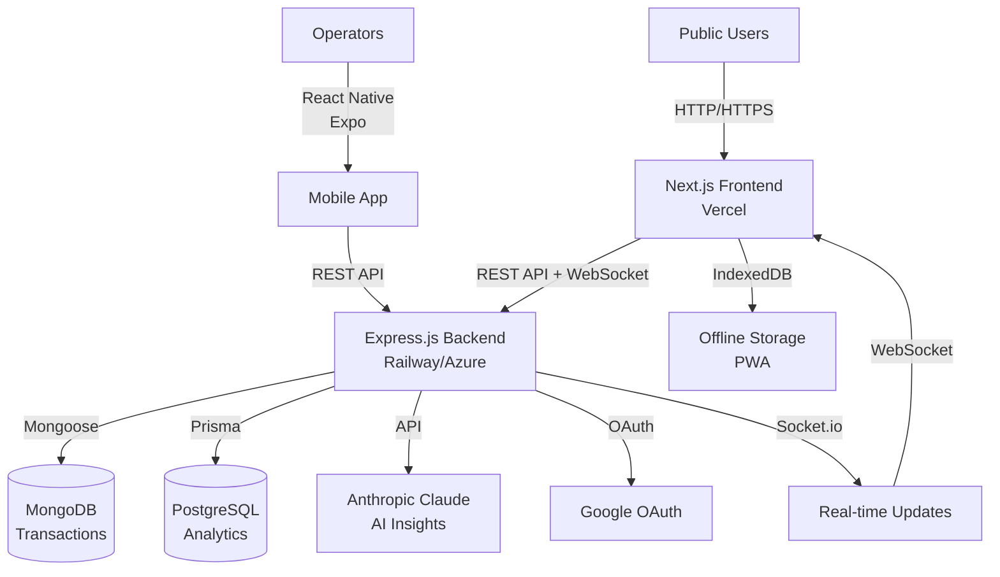

# 🛣️ Toll Road Management System

A modern full-stack web application for managing toll roads, vehicle entries, fee collection, and real-time analytics with AI-powered insights.

---

## 🏗️ Architecture Overview



---

## 📊 System Components

| Component | Technology | Purpose |
|-----------|-----------|----------|
| **Frontend** | Next.js, TypeScript, Tailwind CSS, Redux | User interfaces, dashboard, analytics |
| **Backend API** | Express.js, Node.js, JWT | REST endpoints, business logic |
| **Real-time** | Socket.io | Live transaction updates |
| **Databases** | MongoDB + PostgreSQL | Transaction logs + analytics |
| **Authentication** | JWT + Google OAuth | Secure user access |
| **AI** | Anthropic Claude | Traffic/revenue insights |
| **Mobile** | React Native (Expo) | Operator log forms |
| **Deployment** | Docker, GitHub Actions, Vercel, Railway | CI/CD pipeline |

---

## 🎯 Key Features

### ✅ Unit 1: Fundamentals
- Organized `/client`, `/server`, `/mobile` structure
- RESTful API communication
- Static landing page (HTML5 + CSS3)
- Git-ready project layout

### ⚛️ Unit 2: Frontend
- Next.js with SSR (dashboard) and SSG (landing)
- React hooks & TypeScript throughout
- Redux Toolkit for global state
- Context API for theme switching
- Tailwind CSS responsive design
- Recharts for analytics visualization
- PWA with service worker & manifest
- Fully offline-capable

### 🖥️ Unit 3: Backend
- Express.js REST API with 10+ routes
- JWT + OAuth authentication
- MongoDB (Mongoose) for transactions
- PostgreSQL (Prisma) for analytics
- Socket.io real-time updates
- Role-based access control (admin/operator)

### ☁️ Unit 4: Cloud & DevOps
- Docker containerization
- GitHub Actions CI/CD pipeline
- Vercel deployment (frontend)
- Railway deployment (backend)
- Morgan HTTP logging
- Winston error logging
- Environment configuration

### 🤖 Unit 5: Emerging Trends & Security
- Anthropic Claude AI insights
- React Native mobile screen
- bcrypt password hashing
- Zod validation (frontend & backend)
- rate-limiting middleware
- Helmet.js headers
- CORS configuration
- HTTPS enforcement

---

## 📦 Project Structure

```
toll-road-management/
├── client/                    # Next.js Frontend
├── server/                    # Express.js Backend
├── mobile/                    # React Native (Expo)
├── docker-compose.yml
├── .github/workflows/deploy.yml
└── README.md
```

---

## 🚀 Quick Start

### Prerequisites
- Node.js 18+
- Docker & Docker Compose
- MongoDB Cloud (Atlas)
- PostgreSQL 14+

### Local Development

**Backend:**
```bash
cd server
cp .env.example .env
npm install
npm run dev
```

**Frontend:**
```bash
cd client
cp .env.local.example .env.local
npm install
npm run dev
```

**With Docker:**
```bash
docker-compose up --build
```

---

## 🔑 API Endpoints

### Authentication
```
POST /api/auth/register
POST /api/auth/login
POST /api/auth/logout
GET  /api/auth/me
POST /api/auth/refresh
GET  /api/auth/google
```

### Booths
```
GET  /api/booths
POST /api/booths (admin only)
GET  /api/booths/:id
PUT  /api/booths/:id (admin only)
DELETE /api/booths/:id (admin only)
```

### Transactions
```
POST /api/transactions
GET  /api/transactions
GET  /api/transactions/:id
```

### Analytics
```
GET /api/analytics/revenue
GET /api/analytics/traffic
GET /api/analytics/booth-performance
```

### AI Insights
```
GET /api/ai/insights
GET /api/ai/traffic-pattern
GET /api/ai/revenue-analysis
```

---

## 🔐 Security Features

✅ JWT authentication with refresh tokens  
✅ Google OAuth integration  
✅ bcrypt password hashing  
✅ Zod input validation  
✅ Rate limiting  
✅ Helmet.js security headers  
✅ CORS configuration  
✅ HTTPS in production  

---

## 🐳 Deployment

**Frontend:** Vercel  
**Backend:** Railway or Azure App Service  
**CI/CD:** GitHub Actions  
**Containers:** Docker & Docker Compose  

---

**Last Updated:** 2026-05-14  
**Version:** 1.0.0
